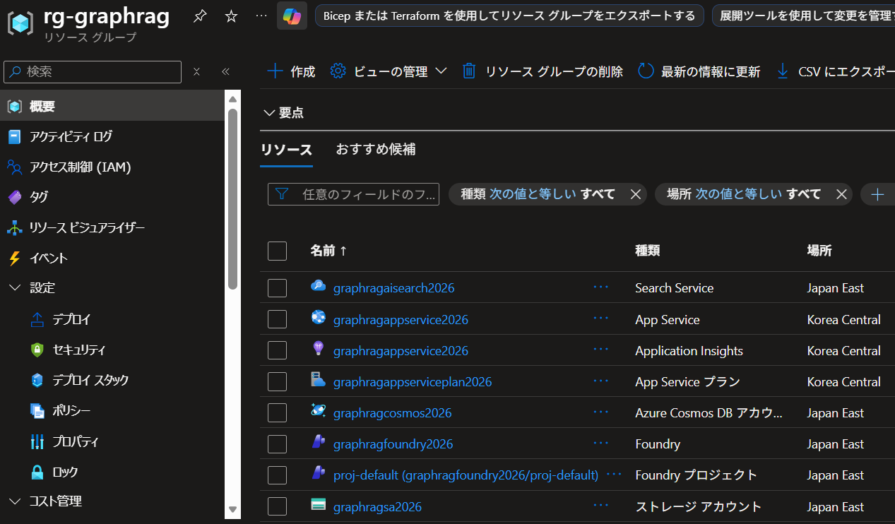
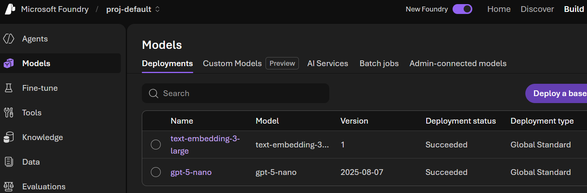
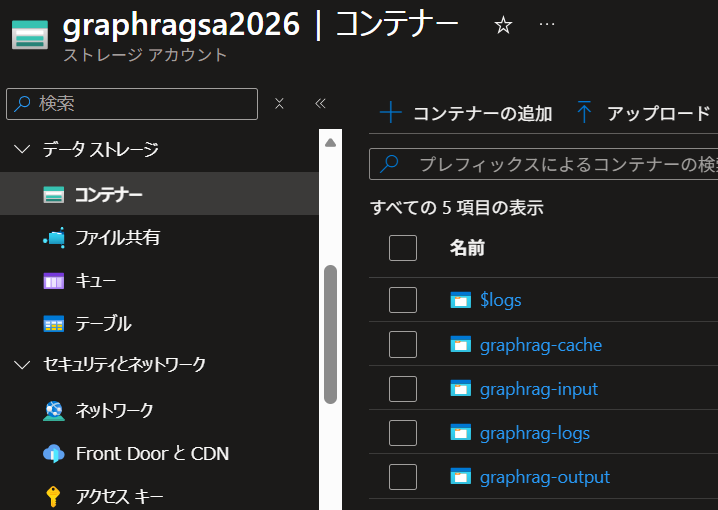
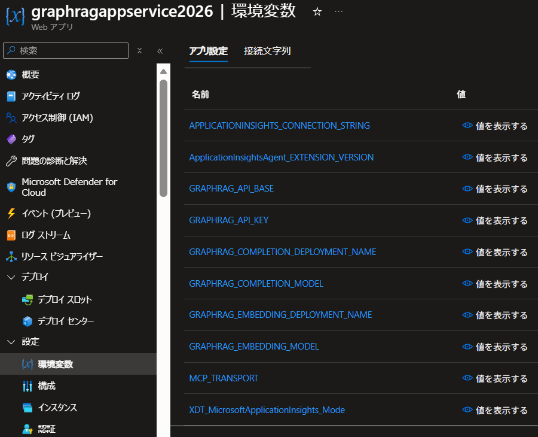
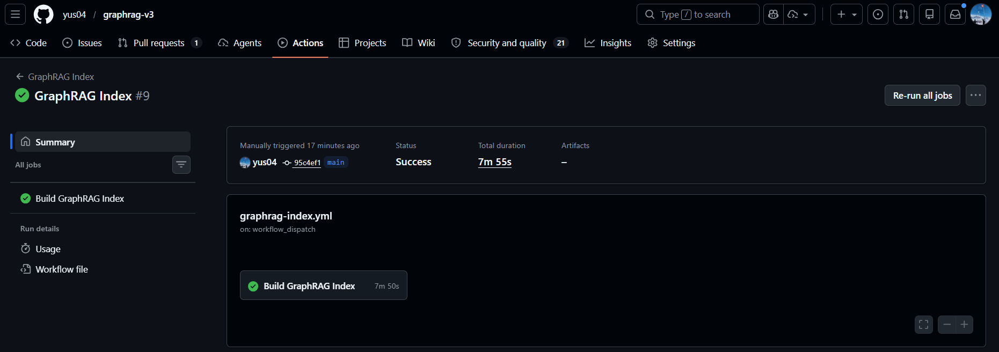
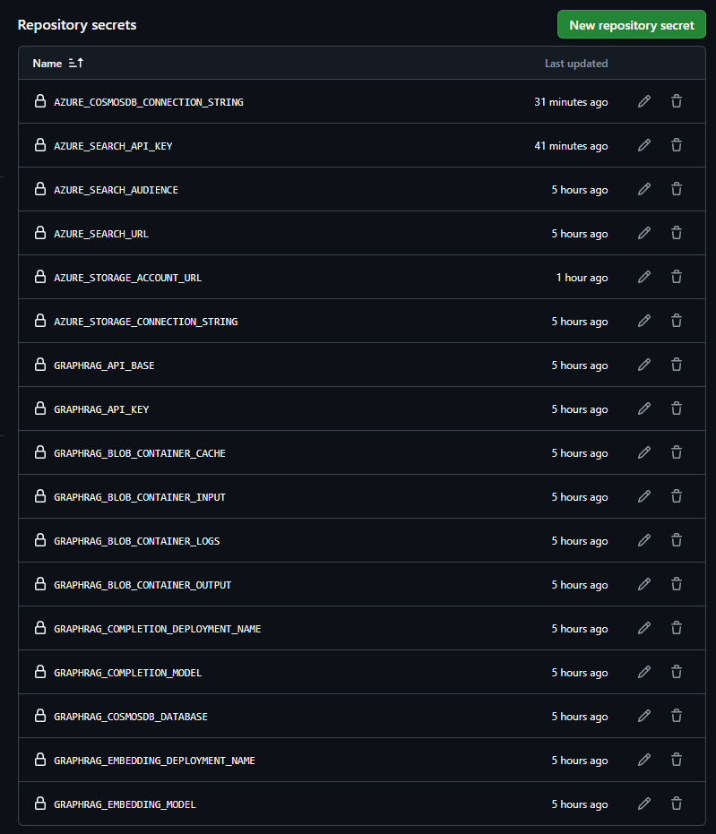

# graphrag-v3

本リポジトリのコードは、[GraphRAG v3](https://github.com/microsoft/graphrag) を使ったアプリケーションを Azure で公開するためのサンプルコードです。`uv run graphrag init` により構成されたプロジェクトをベースに、MCP サーバー化のための実装を行っています。

本 README では、ローカルでの利用方法と Azure での利用方法についてそれぞれ解説します。具体的には、ローカルでは GraphRAG CLI を使った手順についての解説、Azure では GitHub Actions 上で GraphRAG CLI 操作する CI/CD の構築と、Azure App Service で MCP サーバーを公開する手順について解説します。

> ⚠️ 本リポジトリのコードはサンプルコードであるため、コードが正しく動くことを保証するものではございません。GraphRAG MCP サーバー実装の参考としてご活用ください。

## 要件

- [uv](https://docs.astral.sh/uv/) がインストールされていること
- Python 3.12（uv が自動管理）

---

## ローカル環境での利用

### 1. リポジトリのクローン／ディレクトリへ移動

```bash
cd graphrag-v3
```

### 2. 依存パッケージのインストール

```bash
uv sync
```

`uv sync` を実行すると `.venv` が作成され、`graphrag==3.0.6` を含むすべての依存パッケージがインストールされます。

### 3. サンプルテキストの取得

```bash
curl https://www.gutenberg.org/cache/epub/24022/pg24022.txt -o ./input/book.txt
```

### 4. 環境変数の設定

`.env.example` をコピーして `.env` を作成します。

```bash
cp .env.example .env
```

`.env` には以下の変数が含まれます。ローカル環境では主に **API credentials** の設定が必要です。

```env
# --- API credentials ---
GRAPHRAG_API_KEY=<Azure OpenAI の API キー>
GRAPHRAG_API_BASE=https://<your-resource>.services.ai.azure.com
```

モデル名・デプロイメント名は実際の Microsoft Foundry リソースに合わせて変更してください。

#### settings.yaml のローカル向け設定

リポジトリの `settings.yaml` はデフォルトで **Azure 環境（Blob Storage / CosmosDB / Azure AI Search）向け**に設定されています。ローカルで動かす場合は、ファイルストレージと LanceDB を使う設定に書き換える必要があります。

`settings.yaml.example` を参照しながら、以下の箇所を変更してください。

```yaml
input_storage:
  type: file
  base_dir: "${GRAPHRAG_INPUT_BASE_DIR}"   # .env では input

output_storage:
  type: file
  base_dir: "${GRAPHRAG_OUTPUT_BASE_DIR}"  # .env では output

reporting:
  type: file
  base_dir: "${GRAPHRAG_LOGS_BASE_DIR}"    # .env では logs

cache:
  type: json
  storage:
    type: file
    base_dir: "${GRAPHRAG_CACHE_BASE_DIR}" # .env では cache

vector_store:
  type: lancedb
  db_uri: ${GRAPHRAG_LANCEDB_URI}          # .env では output/lancedb
```

#### Azure マネージド ID を使う場合（ローカル）

API キーの代わりにローカルの Azure CLI 認証を使う場合、`settings.yaml` の各モデルの `auth_method` を変更し、`api_key` の行を削除します。

```yaml
auth_method: azure_managed_identity
```

次に Azure CLI でログインします。

```bash
az login
```

### 5. インデックスの構築

```bash
uv run graphrag index --root .
```

完了後、`./output/` に Parquet ファイル群が生成されます。

#### インデックスの更新（差分のみ）

新しいドキュメントを追加したあとは `graphrag update` サブコマンドで差分のみ更新できます。

```bash
uv run graphrag update --root .
```

デフォルトの `--method standard` の代わりに高速版を使う場合は以下のとおりです。

```bash
uv run graphrag update --root . --method fast
```

### 6. クエリの実行

#### グローバル検索（高レベルな質問）

```bash
uv run graphrag query "What are the top themes in this story?"
```

#### ローカル検索（特定の登場人物など）

```bash
uv run graphrag query \
  "Who is Scrooge and what are his main relationships?" \
  --method local
```

### 7. MCP サーバーの起動（stdio）

ローカルの MCP クライアント（Claude Desktop / Cursor / VS Code）向けには **stdio トランスポート**を使います。(※このコマンドを実行しても動作確認はできないので、コマンド実行後は `Ctrl + C` で停止してください。)

```bash
uv run graphrag-mcp
```

プロジェクトのルートディレクトリを変更する場合:

```bash
GRAPHRAG_ROOT=/path/to/project uv run graphrag-mcp
```

#### 公開されるツール

| ツール名 | 説明 |
|----------|------|
| `graphrag_global_search` | コミュニティサマリー全体を横断する広域検索（テーマ・傾向の質問に最適） |
| `graphrag_local_search` | エンティティ周辺コンテキストを使った局所検索（人物・組織の詳細に最適） |
| `graphrag_drift_search` | グローバル＋ローカルのハイブリッド DRIFT 検索 |
| `graphrag_basic_search` | テキストチャンクへのベクトル類似度検索（最も軽量） |

すべてのツールは `response_type` パラメーターで回答形式を指定できます（例: `"Multiple Paragraphs"`, `"List of 3-7 Points"` など）。

#### Visual Studio Code での起動
.vscode/mcp.json から graphrag を Start させることで、MCP サーバーの起動が可能です。

### 8. 開発・テスト

#### MCP サーバーへの接続テスト

以下のコマンドを実行し、レスポンスが返ってきたら `Ctrl + C` で停止します。

```bash
(printf \
'{"jsonrpc":"2.0","id":1,"method":"initialize","params":{"protocolVersion":"2024-11-05","capabilities":{},"clientInfo":{"name":"test","version":"0"}}}
{"jsonrpc":"2.0","method":"notifications/initialized","params":{}}
{"jsonrpc":"2.0","id":2,"method":"tools/call","params":{"name":"graphrag_global_search","arguments":{"query":"What are the top themes in this story?"}}}
'; sleep 120) | uv run graphrag-mcp 2>/dev/null
```

#### 開発用依存パッケージのインストール

```bash
uv sync --group dev
```

#### リンター（Ruff）の実行

```bash
uv run ruff check .
uv run ruff format --check .
```

#### テストの実行

```bash
uv run pytest
```

#### 自動フォーマット

```bash
uv run ruff format .
uv run ruff check --fix .
```

---

## Azure 環境での利用

### 1. Azure リソース利用選択

`settings.yaml` は現在 Azure 環境向けの設定のみが記述されています。  
各コンポーネントの選択肢（ローカル / Blob Storage / CosmosDB / Azure AI Search）や認証方法の切り替え例は `settings.yaml.example` を参照してください。  
設定を変更する場合は `settings.yaml.example` を参考に `settings.yaml` を編集してください。

| コンポーネント | `file`（ローカル） | `blob`（Blob Storage） | `cosmosdb`（CosmosDB） | `azure_ai_search` |
|---|:---:|:---:|:---:|:---:|
| `input_storage` | ○ | ○ | ○ | — |
| `output_storage` | ○ | ○ | ○ | — |
| `reporting` | ○ | ○ | — | — |
| `cache.storage` | ○ | ○ | ○ | — |
| `vector_store` | ○ (※) | — | ○ | ○ |

※ ローカルで `lancedb` を利用

#### 参考：用途ごとの推奨 Azure リソース

| 用途 | 推奨サービス | 主な理由 |
|---|:---:|:---:|
| `input_storage` | Blob Storage | Parquet・テキストの大容量バイナリ保存に最適 |
| `output_storage` | Blob Storage | arquet・テキストの大容量バイナリ保存に最適 |
| `reporting` | Blob Storage | サポート対象が blob のみ |
| `cache.storage` | Cosmos DB | ハッシュキーによる O(1) ポイントリード + TTL 自動失効 |
| `vector_store` | AI Search | ベクトル検索専用設計・ハイブリッド検索・HNSW インデックス |

### 2. Azure 環境のセットアップ

#### リソース作成

上記の選択に応じて、Azure リソースを作成します。全てのリソースを作成すると以下のようなリストになります。



#### 権限設定とモデルデプロイ

`Azure AI User` ロールの付与を行った後、Foundry ポータル上でのモデルのデプロイを行ってください。



#### ストレージコンテナの作成

Azure ポータル上で、`.env` で指定している名前のコンテナを作成してください。



#### ファイルアップロード

作成したコンテナのうち、 `GRAPHRAG_BLOB_CONTAINER_INPUT` で指定した名前のコンテナにファイルをアップロードしてください。

[サンプルファイル](https://www.gutenberg.org/cache/epub/24022/pg24022.txt)

#### Cosmos DB コンテナの作成

Cosmos DB を利用する場合は、コンテナの作成を行ってください。

### 3. 環境変数の設定

Azure 環境では、Azure Blob Storage / CosmosDB / AI Search に切り替えるための変数を設定します。`.env` に必要な情報を入力してください。また、利用する Azure リソースや認証方法に応じて `settings.yaml` を更新してください。

### 4. MCP サーバーのデプロイ（Azure App Service）

Azure App Service に公開する場合は **streamable-http トランスポート**を使います。デプロイは、Visual Studio Code の拡張機能等を使って App Service にアプリケーションをデプロイしてください。

#### App Service の環境変数設定

「アプリケーション設定」に以下を追加します。

| 名前 | 値 |
|------|-----|
| `MCP_TRANSPORT` | `streamable-http` |
| `GRAPHRAG_API_KEY` | Azure OpenAI の API キー（マネージド ID 使用時は不要） |
| `GRAPHRAG_API_BASE` | Azure OpenAI エンドポイント |
| `GRAPHRAG_COMPLETION_MODEL` | Completion モデル名 |
| `GRAPHRAG_COMPLETION_DEPLOYMENT_NAME` | Completion デプロイメント名 |
| `GRAPHRAG_EMBEDDING_MODEL` | Embedding モデル名 |
| `GRAPHRAG_EMBEDDING_DEPLOYMENT_NAME` | Embedding デプロイメント名 |

App Service は `PORT` 環境変数を自動設定します。サーバーはこれを自動検出します。

全てのアプリケーション設定を保存すると以下のようになります。



#### スタートアップコマンド

Azure ポータルにて、App Service リソース画面 → 設定 → 構成 → スタック設定 → スタートアップコマンドから以下のコマンドを設定してください。

```bash
python main.py
```

#### HTTP クライアントからの接続確認

ブラウザで App Service のルート URL にアクセスすると以下のレスポンスが返ってきます。

```
{"status":"ok","server":"graphrag-mcp"}
```

#### MCP サーバー環境変数一覧

| 環境変数 | デフォルト | 説明 |
|----------|-----------|------|
| `GRAPHRAG_ROOT` | `main.py` と同じディレクトリ | GraphRAG プロジェクトのルートパス（通常は設定不要） |
| `MCP_TRANSPORT` | `stdio` | `stdio`（ローカル）または `streamable-http`（Azure） |
| `PORT` | `8000` | HTTP モード時のリスンポート（App Service は自動設定） |
| `MCP_PORT` | `8000` | `PORT` が未設定の場合に参照する代替ポート変数 |

### 5. インデックスの構築（GitHub Actions）

`.github/workflows/graphrag-index.yml` に GraphRAG CLI を使った自動インデックス作成ワークフローが含まれています。認証方法に応じて以下の GitHub Secrets を登録した後、スケジュールもしくは手動実行にてインデックス構築を行ってください。

インデックス構築に成功すると、GitHub Actions では以下のような表示になります。



#### スケジュール

デフォルトでは **毎週日曜 0:00（JST）** に実行されます。  
`cron` 式を変更することでスケジュールをカスタマイズできます。

#### 手動実行

GitHub Actions の UI から **「Run workflow」** をクリックして手動実行できます。  
インデックス方法（`auto` / `standard` / `fast` / `update-standard` / `update-fast`）を選択できます。

| 選択肢 | 実行コマンド | 説明 |
|--------|------------|------|
| `auto` | 自動判定 | Blob Storage 上の `entities.parquet` の有無でフルビルド／差分更新を自動選択（デフォルト） |
| `standard` | `graphrag index --method standard` | フルビルド |
| `fast` | `graphrag index --method fast` | フルビルド（高速版） |
| `update-standard` | `graphrag update --method standard` | 差分更新 |
| `update-fast` | `graphrag update --method fast` | 差分更新（高速版） |

#### API キーを使う場合の GitHub Secrets 設定

リポジトリの **Settings → Secrets and variables → Actions** に以下を登録します。

| Secret 名 | 説明 |
|-----------|------|
| `GRAPHRAG_API_KEY` | Azure OpenAI の API キー |
| `GRAPHRAG_API_BASE` | Azure OpenAI エンドポイント URL |
| `GRAPHRAG_COMPLETION_MODEL` | 補完モデル名 |
| `GRAPHRAG_COMPLETION_DEPLOYMENT_NAME` | 補完モデルのデプロイ名 |
| `GRAPHRAG_EMBEDDING_MODEL` | 埋め込みモデル名 |
| `GRAPHRAG_EMBEDDING_DEPLOYMENT_NAME` | 埋め込みモデルのデプロイ名 |
| `AZURE_STORAGE_CONNECTION_STRING` | Azure Storage 接続文字列 |
| `AZURE_STORAGE_ACCOUNT_URL` | Azure Storage アカウント URL |
| `GRAPHRAG_BLOB_CONTAINER_INPUT` | 入力用 Blob コンテナ名 |
| `GRAPHRAG_BLOB_CONTAINER_OUTPUT` | 出力用 Blob コンテナ名（インデックス有無の判定にも使用） |
| `GRAPHRAG_BLOB_CONTAINER_LOGS` | ログ用 Blob コンテナ名 |
| `GRAPHRAG_BLOB_CONTAINER_CACHE` | CosmosDB キャッシュ用コンテナ名 |
| `AZURE_COSMOSDB_CONNECTION_STRING` | CosmosDB 接続文字列（キャッシュ用） |
| `GRAPHRAG_COSMOSDB_DATABASE` | CosmosDB データベース名 |
| `AZURE_SEARCH_URL` | Azure AI Search エンドポイント URL |
| `AZURE_SEARCH_AUDIENCE` | Azure AI Search の audience |
| `AZURE_SEARCH_API_KEY` | Azure AI Search API キー |

全てのシークレットを保存すると以下のようになります。



#### マネージド ID（OIDC フェデレーション認証）を使う場合

API キーの代わりに OpenID Connect（OIDC）で認証する場合、ワークフローファイルの `Azure Login (OIDC)` ステップのコメントを外し、以下の Secrets を設定してください。

| Secret 名 | 説明 |
|-----------|------|
| `AZURE_CLIENT_ID` | サービスプリンシパルまたはマネージド ID のクライアント ID |
| `AZURE_TENANT_ID` | Azure テナント ID |
| `AZURE_SUBSCRIPTION_ID` | Azure サブスクリプション ID |

またワークフローの `permissions` に `id-token: write` を追加してください。

```yaml
permissions:
  contents: read
  id-token: write
```

### 6. MCP サーバー利用

以下のコマンドで MCP Inspecor を起動し、MCP サーバーにアクセスしてください。

```bash
npx @modelcontextprotocol/inspector
```

→ Inspector UI で http://localhost:8000/mcp へ接続

#### 注意事項

- 本プロジェクトの GraphRAG MCP サーバーは認証機能が無いため、本番運用を考慮する際には Azure API Management 等を使って認証レイヤーを加えることが必須です。
- MCP Inspector から MCP Server にアクセス可能にするため、CORS ミドルウェアを追加しています。任意の `allow_origins` を指定しているため、MCP Inspector を利用しない場合は CORS ミドルウェアを削除したりオリジンを指定するなどの対応をしてください。

## 参考リンク

- [GraphRAG ドキュメント](https://microsoft.github.io/graphrag/)
- [GraphRAG CLI リファレンス](https://microsoft.github.io/graphrag/cli/)
- [設定リファレンス](https://microsoft.github.io/graphrag/config/yaml/)
- [クエリエンジン](https://microsoft.github.io/graphrag/query/overview/)
- [MCP Python SDK](https://github.com/modelcontextprotocol/python-sdk)
- [Azure App Service ドキュメント](https://learn.microsoft.com/azure/app-service/)
- [Azure AI Search ドキュメント](https://learn.microsoft.com/azure/search/)
